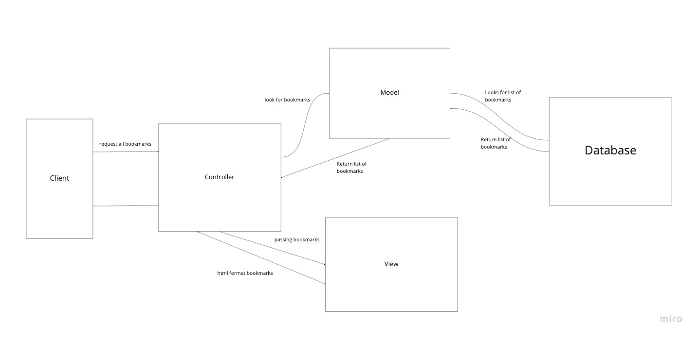
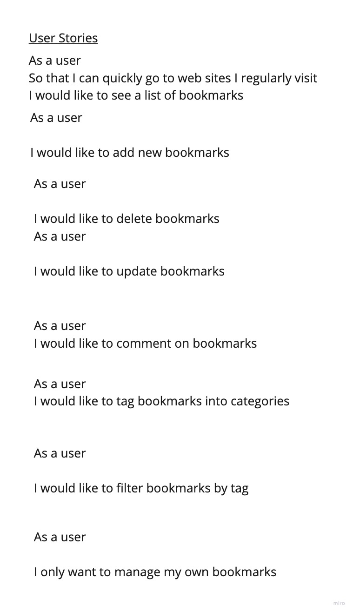

# Bookmarks Manager





### To set up the database

Download PostgreSQL with Homebrew
```
$ brew install postgresql
```

Start PostgreSQL 
```
$ brew services start postgresql
```

Connect to `psql` and create the `bookmark_manager` database:

```
CREATE DATABASE bookmark_manager;
```

To set up the appropriate tables, connect to the database in `psql` and run the SQL scripts in the `db/migrations` folder in the given order.